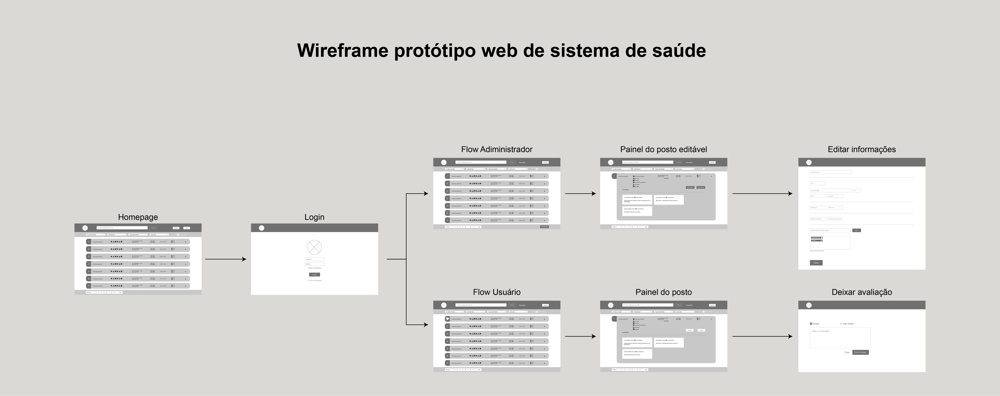
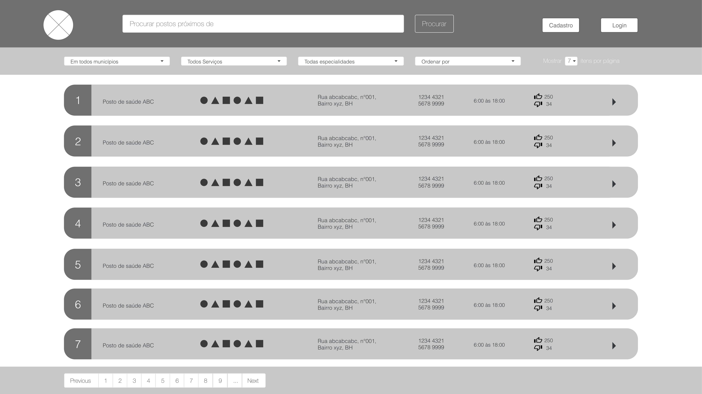
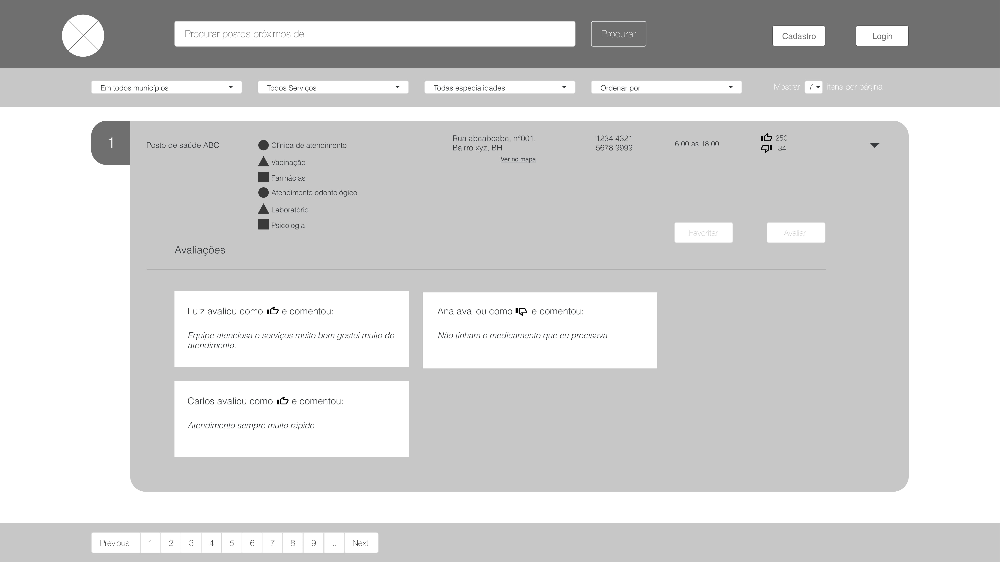
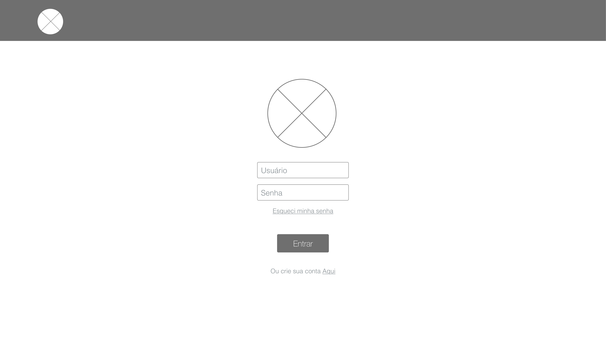
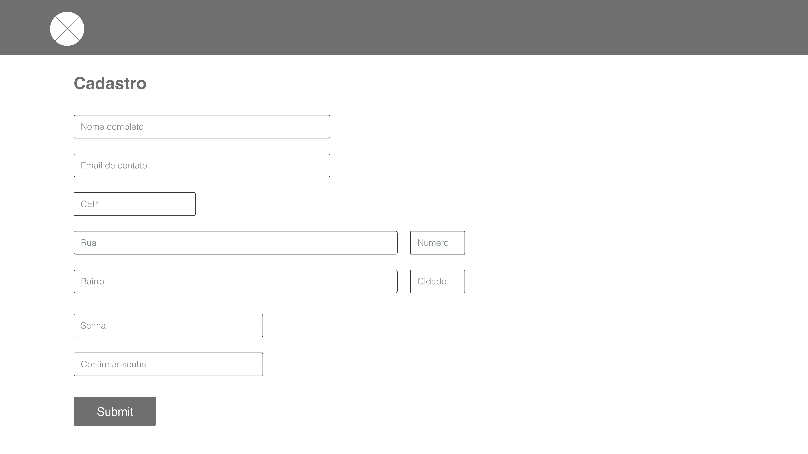
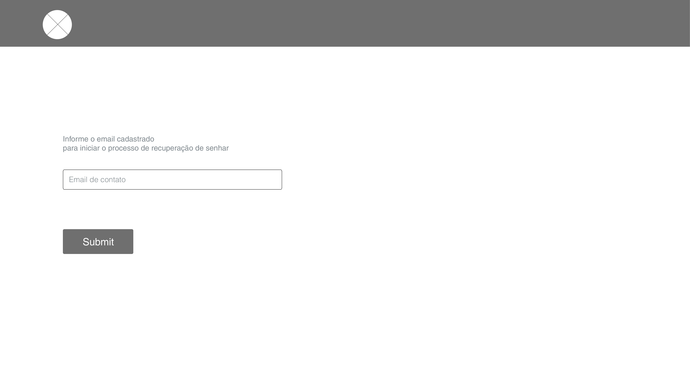
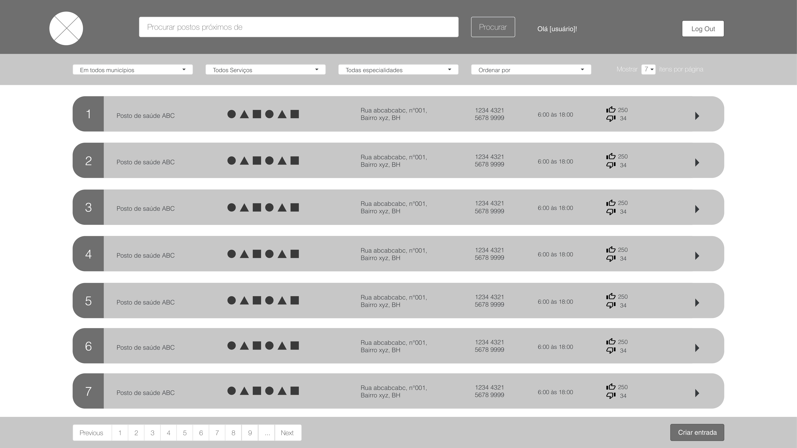
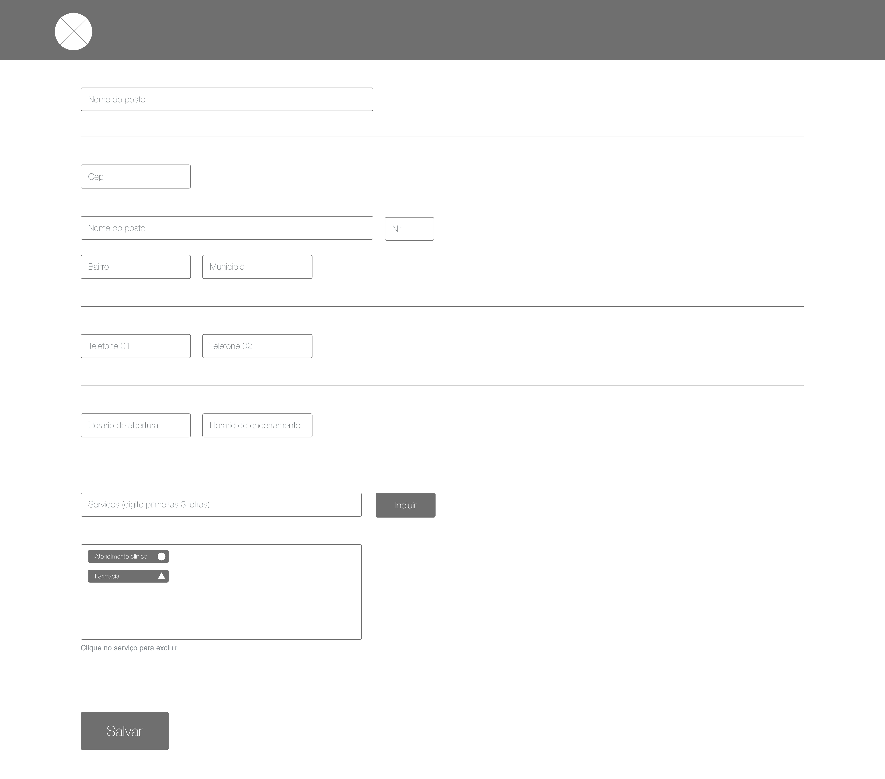
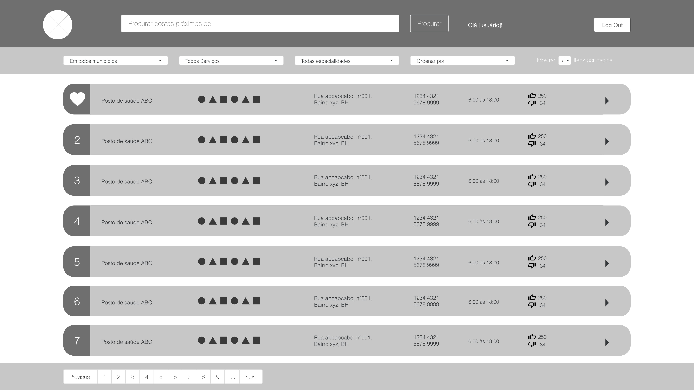
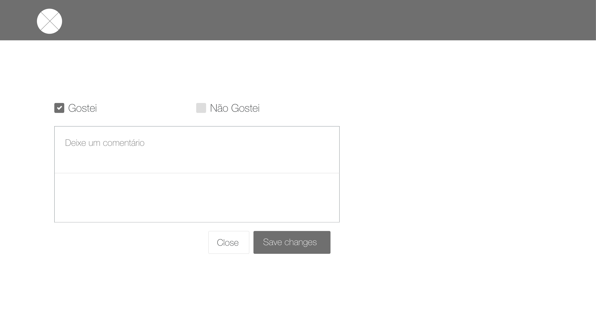

# Projeto de Interface

Representação da aplicação Web. O usuário consegue acessar as informações direto do navegador, listando os postos de saúde, selecionando filtros, salvando suas preferências nos favoritos e até visualizar as avaliações de outros usuários sobre o posto, além do administrador que exclusivamente pode gerenciar os registros dos postos.

## User Flow

Nesta aplicação existem três estados de usuário: **Deslogado**, **Logado como administrador** e **Logado como usuário**.

O fluxo da aplicação pode ser visualizada [aqui](https://xd.adobe.com/view/1fa69cfe-7b9e-4420-acf0-4e8b20ae8042-4af5/) e na imagem abaixo.

## Wireframes
O objetivo de cada tela em seu respectivo flow pode ser observado nas descrições a seguir.

### Flow Deslogado
Nesse ponto o usuário não realizou o acesso utilizando sua conta, dessa forma nenhuma informação sobre as preferências será salva.

- Homepage: 
Nessa tela o usuário consegue pesquisar por postos de saúde com base na localidade, tipos de serviços e especialidades além de poder ordenar como desejar.

- Painel do posto: 
Nessa tela é possível abrir o mapa e visualizar as avaliações do posto.

- Login: 
Nessa tela o usuário informa login e senha, caso aceito redireciona-o para a homepage que ele possui permissão (Administrador ou Usuário).

- Cadastro Usuário: 
Nessa tela é possível criar uma conta para o usuário, existem funcionalidades que são exclusivas para quem possui cadastro.

- Resetar Senha: 
Com as inúmeras senhas que são utilizadas hoje em dia é comum esquecer algumas, nessa tela é possível solicitar redefinição da senha de acesso.

### Flow Admin
Nesse flow o usuário realizou acesso usando conta com cargo administrativo, ele pode realizar cadastros e editar as informações sobres os postos.

- Homepage: 
Nessa tela o usuário consegue pesquisar por postos de saúde com base na localidade, tipos de serviços e especialidades além de poder ordenar como desejar.

- Painel do posto editável: 
Permite visualizar informações do posto e possui botões para abrir o mapa, excluir e abrir a página de edição do cadastro.
-1.jpg)

- Editar informações do posto: 
Nessa tela todos os campos do cadastro base do posto podem ser editados.

- Cadastrar novo posto: 
Permite o usuário inserir um novo registro de algum posto de saúde.

### Flow Usuário
Nessa parte o usuário realizou o acesso utilizando uma conta sem privilégios de administrador, ele pode avaliar e salvar postos em seus favoritos

- Homepage: 
Nessa tela o usuário consegue pesquisar por postos de saúde com base na localidade, tipos de serviços e especialidades além de poder ordenar como desejar.

- Painel do posto: 
Nessa tela é possível adicionar o posto aos favoritos, ir para a tela de avaliações e abrir o mapa.
–1-1.jpg)

- Deixar avaliação: 
Permite o usuário expressar se gostou ou não dos serviços e anotar suas observações.

