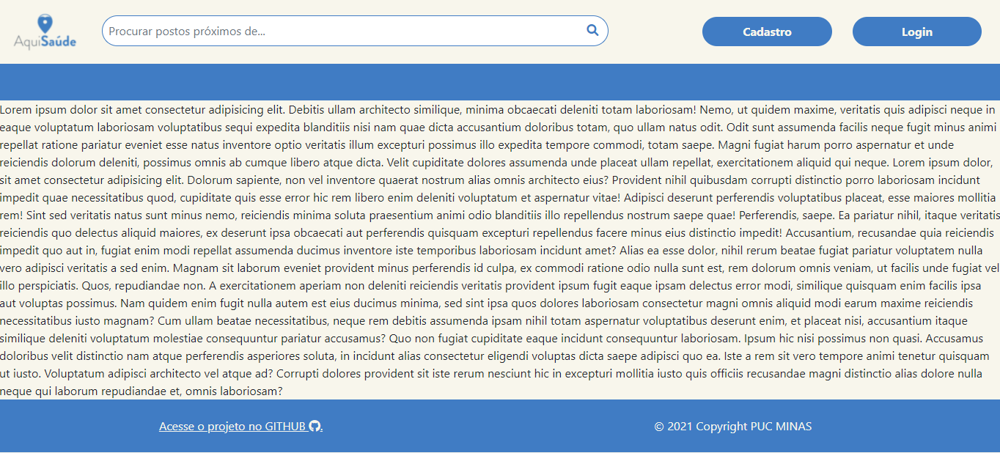
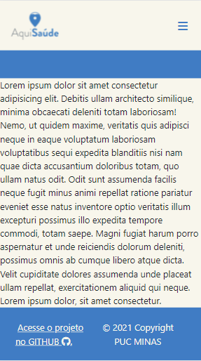
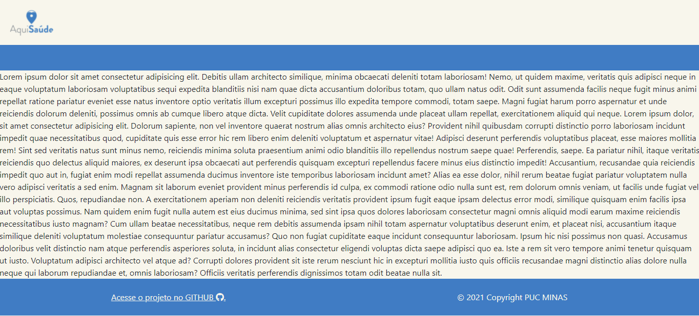
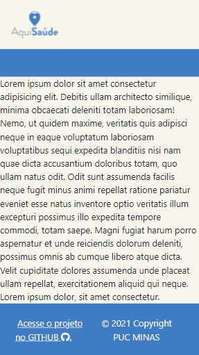
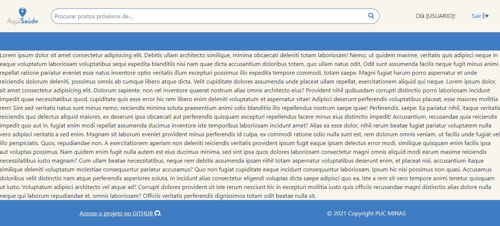

# Template padrão do site

Para a construção dos templates do site foi utilizado o framework bootstrap que atualmente se encontra na versão [v5.1.2 e pode ser encontrado aqui](https://getbootstrap.com/docs/5.1/getting-started/introduction/).

Para personalizações mais específicas será utilizado o arquivo [main.css](/src/css/main.css) e o pacote de ícones [Font Awesome](https://fontawesome.com/). Todos os templates são responsívos sendo possível acessá-los tanto pelo navegador de um *Desktop* quanto de um *Smartphone*.

Acesse os templates nos links abaixo:
## [Template deslogado](https://aquisaude.netlify.app/template-nav1.html)
### Desktop

### Smartphone

---
## [Template Limpo](https://aquisaude.netlify.app/template-nav2.html)
### Desktop

### Smartphone

---
## [Template Logado](https://aquisaude.netlify.app/template-nav3.html)
### Desktop

### Smartphone
